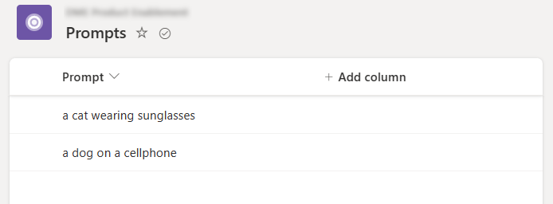
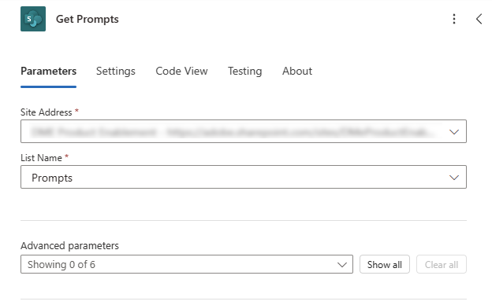
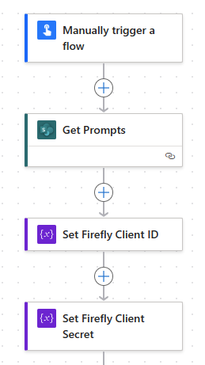
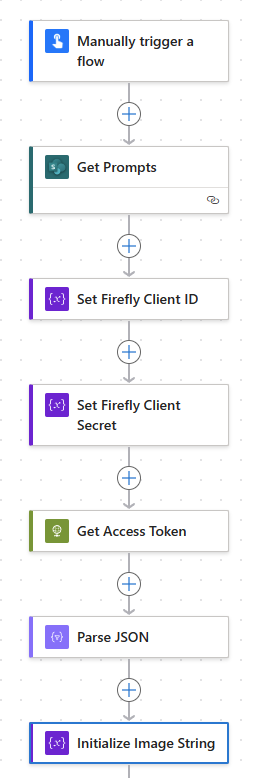
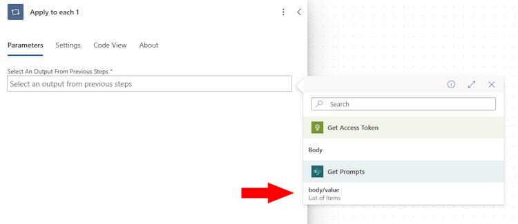
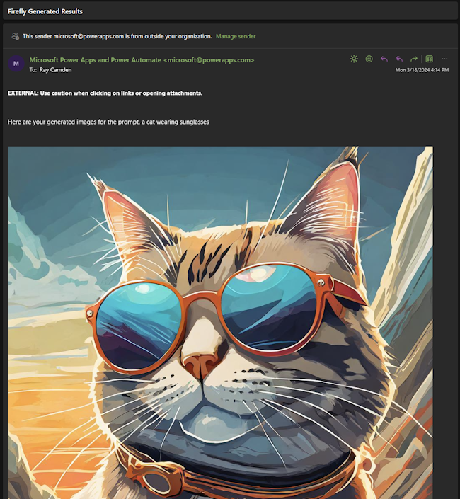

# Harnassing the Firefly Services APIs in PowerAutomate

Microsoft's [Power Automate](https://make.powerautomate.com) is a powerful no-code solution that lets developers and non-developers alike create flexible workflows to automate processing using multiple different services. Firefly Services can be employed in the Power Automate platform and in this article, we'll walk you through the process of creating a sample workflow. Keep in mind that Power Automate is incredibly flexible and the example shown here is just one possible use of the platform.

## Prereqs

In order to complete this tutorial, you will need:

* Firefly API credentials. You can sign up for [free trial credentials](https://developer.adobe.com/firefly-api) and use them for this tutorial. You will need two values: `client_id` and `client_secret`. 
* An account with Microsoft and access to Power Automate. 

## Our Workflow

Our workflow will use the Firefly API to generate images. The steps involved are:

* Reading a set of prompts from a Microsoft List
* Sending each prompt to Firefly
* Taking the result and sending an email

For simplicity's sake, this flow will be manually triggered, but certainly, you could create a workflow that was dynamically triggered.

## Step One - Defining our Prompts

As described earlier, a Microsoft List will be used to define our prompts. We created a new list, named it "Prompts", and added two simple values in the first column.



## Step Two - Create the Flow

Next, create a new "Instant" Power Automate flow. This will let us test as needed and won't be tied to any automatic process. Everything demonstrated in this article absolutely *could* run in that type of scenario. 

## Step Three - Read our List

PowerAutomate has steps that automatically integrate with Lists, so the next step will be to add the "Get items" action from Sharepoint. This will require you to configure the Sharepoint site hosting the list and then select the list. 



Note that we've renamed the action to "Get Prompts"

## Step Four - Define Variables

The next two actions aren't technically required, but help us out later in the flow. Create two actions to initialize variables. We're going to create two string values to store our Firefly authentication. The first one should use these values:

* Name: FIREFLY_CLIENT_ID
* Type: String
* Value: Your client id

Name this step, "Set Firefly Client ID".

The next one will use these values:

* Name: FIREFLY_CLIENT_SECRET
* Type: String
* Value: Your client secret

Name this step, "Set Firefly Client Secret".

At this point, your flow should look like so:



## Step Five - Exchange Credentials

The next step will use the HTTP action to exchange our credentials for an access token. Add a new step, HTTP, and use the following URI:

```
https://ims-na1.adobelogin.com/ims/token/v3?grant_type=client_credentials&client_id=@{variables('FIREFLY_CLIENT_ID')}&client_secret=@{variables('FIREFLY_CLIENT_SECRET')}&scope=openid,AdobeID,firefly_enterprise,firefly_api,ff_apis
```

Note that as soon as you enter that value, the two `variables` section will change to reference the two earlier steps we defined. Set the method to POST and name the action, "Get Access Token".

Follow this with a "Parse JSON" step. The content value will point to the body of the previous step. The schema will be the following:

```json
{
    "type": "object",
    "properties": {
        "access_token": {
            "type": "string"
        },
        "token_type": {
            "type": "string"
        },
        "expires_in": {
            "type": "integer"
        }
    }
}
```

This was created by using the "Use sample payload to generate schema" support in the step and by passing in a previous authentication result. 

The net result of these two steps is to get an access token for Firefly calls and parse the result so Power Automate can make use of it. 

## Step Six - Initialize Image String

Before we start using the API, we need to define a variable, "images", that we'll use for our results. Add a new step to initialize a variable with these values:

* name: images
* type: String
* value: Leave blank

Name this step, "Initialize Image String".

At this point, your flow should look like so:



## Step Seven - Beginning the Loop

Our workflow will generate results for each prompt and email them, so now we add a new action, "Apply to each" (found in the "Control" section when adding a new action). You will be prompted to select an output to drive the looping. If you remember we read in our Microsoft List value in the beginning, so select that: 



All of the next steps will be defined inside this loop. 

## Step Eight - Resetting the Images Variable

Back in step six, we created an image variable named, `images`. The point of this variable is to hold the results from Firefly so that it can be emailed. For each prompt we need to reset this value back to an empty string. So the first step inside our "Apply to each" loop is a "Set the variable value" action. It sets the variable, `images`, to null. You can do this by entering: `@{null}`

## Step Nine - Calling Firefly's Text-to-Image API

Now for the fun part. We'll add another HTTP action that will call the [Text-to-Image](https://developer.adobe.com/firefly-api/api/#operation/v2/images/generate) API. This API call requires just a few parameters, including the prompt and size, as well as the number of desired images if you want more than one. 

Begin by setting the URI to the API endpoint, as specified in the documentation: `https://firefly-api.adobe.io/v2/images/generate`. 

Next, set the method to `POST`. 

To access the API, two credentials must be sent in the headers. Begin by specifying an `Authorization` header which will use the access token gotten earlier. This can be used by inputting this value: `Bearer @{body('Parse_JSON')?['access_token']}`. Next, the header `X-Api-Key` should be set with the Firefly Client ID specified earlier: `@{variables('FIREFLY_CLIENT_ID')}`

The last thing required is the actual body of the request. The number of images and size will be hard coded, with the prompt being dynamic based on the loop value:

```json
{
  "n": 4,
  "prompt": "@{items('Apply_to_each')?['Title']}",
  "size": {
    "width": "1024",
    "height": "1024"
  }
}
```

This step should then be followed with a Parse JSON action again. Add that step and name it "Parse Firefly Result JSON". Point it to the Body of the previous step, and use this schema:

```json
{
    "type": "object",
    "properties": {
        "version": {
            "type": "string"
        },
        "size": {
            "type": "object",
            "properties": {
                "width": {
                    "type": "integer"
                },
                "height": {
                    "type": "integer"
                }
            }
        },
        "predictedContentClass": {
            "type": "string"
        },
        "outputs": {
            "type": "array",
            "items": {
                "type": "object",
                "properties": {
                    "seed": {
                        "type": "integer"
                    },
                    "image": {
                        "type": "object",
                        "properties": {
                            "id": {
                                "type": "string"
                            },
                            "presignedUrl": {
                                "type": "string"
                            }
                        }
                    }
                },
                "required": [
                    "seed",
                    "image"
                ]
            }
        }
    }
}
```

As before, the net result of these two steps is to make an HTTP call and parse the result into usable data. 

## Step Ten - Defining Image HTML

The next step will be twofold. We want to create a string variable for email that will include all the results from the Firefly call, but we want to define this in HTML. To do this, create another "Apply to each" step. This will use the output from the previous step that parsed the JSON result of the Firefly call: `@{body('Parse_Firefly_Result_JSON')?['outputs']}` Notice we're specifically using the `outputs` portion of the result which will contain one object per image result. 

Within this loop, add an "Append to String variable" step. The variable will be `images`, and the value, this little bit of complex logic: 

```
@{concat('')}
```

This value uses the `contact` function to join three strings:

* First, the beginning of an HTML image tag.
* Then, the current image from the `outputs` loop, specifying the `presignedUrl` value
* A closing bracket.

## Step Eleven - Email the Result

The final step will handle emailing the result. You want to ensure it's in the loop for our prompts, but *not* the previous loop that iterated over the image results. 

For the `To` field, specify your email and pick anything appropriate for the `Subject`. 

The body should contain the prompt and our `images` variable:

```
Here are your generated images for the prompt, @{items('Apply_to_each')?['Title']}

@{variables('images')}
```

## Results

With the flow complete, we can now save and test. As it processes, it will fire off one email as each prompt is done. The images are somewhat large so the screenshot below only shows one, but the additional results are directly beneath it:

