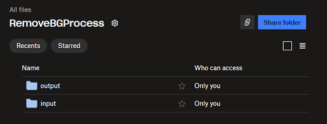
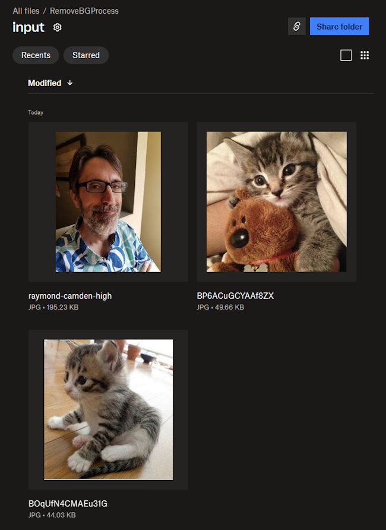
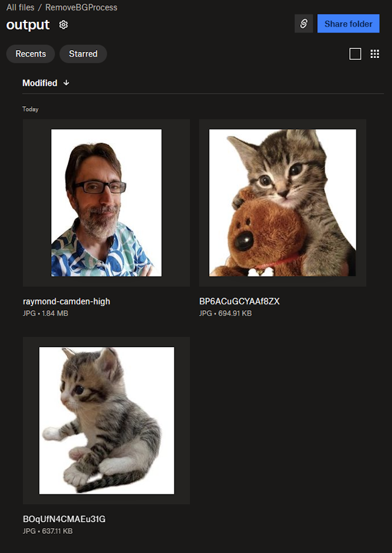

# Automating Imaging Workflows - Background Removal at Scale

One of the more simpler APIs to use with the [Photoshop API](https://developer.adobe.com/firefly-services/docs/photoshop/) is the ability to remove a background. You provide a source, an output, and that's pretty much it. But where the real power comes in is setting this up to work at scale, where automation is used to handle this task automatically, saving your designers time in their day to day workload. In this article, we'll demonstrate an example of how such a workload could be built.

## Prerequisites

This example workflow makes use of Python and Dropbox for cloud storage. Firefly Services credentials are required as well.

## Cloud Storage Setup

The Photoshop API works with multiple cloud storage providers, including Dropbox, Azure, S3, and Google Drive. This workflow will use Dropbox, and specifically a folder named, `RemoveBGProcess`. Under this root folder are two subdirectories, `input` and `output`. 



The process we create will read from `input` and store results in `output`. 

## Step One - Imports

Let's begin by importing our required dependencies in our script:

```python
import os
import requests 
import dropbox
import time 
from dropbox.files import CommitInfo, WriteMode
```

## Step Two - Credentials

All our credentials will be read in from the local environment, so the next step is to read in both Firefly Services credentials, and three required Dropbox credentials:

```python
ff_client_id = os.environ.get('CLIENT_ID')
ff_client_secret = os.environ.get('CLIENT_SECRET')
db_refresh_token = os.environ.get('DROPBOX_REFRESH_TOKEN')
db_app_key = os.environ.get('DROPBOX_APP_KEY')
db_app_secret = os.environ.get('DROPBOX_APP_SECRET')
```

If making use of another cloud storage provider, you will want to tweak both the imports as well as the credential information.

## Step Three - Dropbox Code

The next set of code specifies our root folder in Dropbox and defines a set of utility methods. Again, if using another storage system, these methods would change.

```python
# Base folder to use in Dropbox 
db_base_folder = "/RemoveBGProcess/"

def dropbox_connect(app_key, app_secret, refresh_token):
	try:
		dbx = dropbox.Dropbox(app_key=app_key, app_secret=app_secret, oauth2_refresh_token=refresh_token)
	except AuthError as e:
		print('Error connecting to Dropbox with access token: ' + str(e))
	return dbx

def dropbox_get_read_link(path):
	link = dbx.sharing_create_shared_link(path).url
	return link.replace("dl=0","dl=1")

def dropbox_get_upload_link(path):
	commit_info = CommitInfo(path=path, mode=WriteMode.overwrite)
	return dbx.files_get_temporary_upload_link(commit_info).link

def dropbox_get_input_files():
	return dbx.files_list_folder(f'{db_base_folder}input').entries
```

We've got methods for:

* Connecting to Dropbox via the SDK with our credentials
* Creating links for reading and writing to Dropbox
* Getting a list of files

## Step Four - Get Input Files

With the methods we've defined, we can now connect to Dropbox, get the files, and iterate over them:

```python
dbx = dropbox_connect(db_app_key, db_app_secret, db_refresh_token)

# Get a list of input files to process
input_files = dropbox_get_input_files()

print(f"There are {len(input_files)} file(s) to process.")

for file in input_files:

	print(f"Working on {file.name}")
	# We need two links, a readable for input, and an writeable for output
	read_link = dropbox_get_read_link(file.path_display)
	write_link = dropbox_get_upload_link(f"{db_base_folder}output/{file.name}")
```

## Step Five - Working with Photoshop

Before making use of any Photoshop API calls, we need to authenticate. This is done via a simple API call that requires the client ID and secret values:

```python
def getFFAccessToken(id, secret):
	response = requests.post(f"https://ims-na1.adobelogin.com/ims/token/v3?client_id={id}&client_secret={secret}&grant_type=client_credentials&scope=openid,AdobeID,firefly_enterprise,firefly_api,ff_apis")
	return response.json()['access_token']
```

The [Remove Background API](https://developer.adobe.com/firefly-services/docs/photoshop/api/photoshop_removeBackground/) has only two required arguments, `input` and `output`. More options exist to help optimize the process, but we can leave them off for now. 

The result of the API is a `job` URL that can be polled on a timed basis to see when it's complete, or if an error was thrown. Here are our two utility methods to wrap those calls:

```python

def createRemoveBackgroundJob(input, output, id, token):
	
	data = {
		"input": {
			"href":input, 
			"storage":"dropbox"
		},
		"output":{
			"href":output, 
			"storage":"dropbox"
		}
	}
	response = requests.post(f"https://image.adobe.io/sensei/cutout", headers = {"Authorization": f"Bearer {token}", "x-api-key": id }, json=data)
	return response.json()

def pollJob(job, id, token):
	jobUrl = job["_links"]["self"]["href"]
	status = "" 
	while status != 'succeeded' and status != 'failed':

		response = requests.get(jobUrl, headers = {"Authorization": f"Bearer {token}", "x-api-key": id })
		json_response = response.json()

		if "status" in json_response:
			status = json_response["status"]
		elif "status" in json_response["outputs"][0]:
			status = json_response["outputs"][0]["status"]
			
		if status != 'succeeded' and status != 'failed':
			time.sleep(3)
		else:
			return json_response
```

Note that both will require the client ID from our credentials as well as the access token we got from the authentication call earlier. 

## Step Six: Calling the Photoshop API Methods

Now, back in our loop, we can add our calls to remove the background of the image and poll for the job completion. Here's the complete loop:

```python
for file in input_files:

	print(f"Working on {file.name}")
	# We need two links, a readable for input, and an writeable for output
	read_link = dropbox_get_read_link(file.path_display)
	write_link = dropbox_get_upload_link(f"{db_base_folder}output/{file.name}")

	# Cool, now, kick off the remove BG job
	job = createRemoveBackgroundJob(read_link, write_link, ff_client_id, ff_access_token)

	# Poll and wait for it to finish
	pollJob(job, ff_client_id, ff_access_token)
```

## Results

We tested with three images in our input folder:



After running our script, here's the output:



## The Full Code, and Considerations

Before sharing the full code below, some things to consider. 

* This script is manually run, but could be set up to run on a schedule. Another option is to use the webhook notification features of your cloud storage provider to 'watch' a folder and fire off the process automatically on new files. Which you pick depends on how quickly you need the images processed and how many are coming in.
* This script does *not* remove the input files, but most likely in production you would want to. If not, you would at least want to make note of what images have already been processed.

```python
import os
import requests 
import dropbox
import time 
from dropbox.files import CommitInfo, WriteMode

ff_client_id = os.environ.get('CLIENT_ID')
ff_client_secret = os.environ.get('CLIENT_SECRET')
db_refresh_token = os.environ.get('DROPBOX_REFRESH_TOKEN')
db_app_key = os.environ.get('DROPBOX_APP_KEY')
db_app_secret = os.environ.get('DROPBOX_APP_SECRET')

# Base folder to use in Dropbox 
db_base_folder = "/RemoveBGProcess/"

def dropbox_connect(app_key, app_secret, refresh_token):
	try:
		dbx = dropbox.Dropbox(app_key=app_key, app_secret=app_secret, oauth2_refresh_token=refresh_token)
	except AuthError as e:
		print('Error connecting to Dropbox with access token: ' + str(e))
	return dbx

def dropbox_get_read_link(path):
	link = dbx.sharing_create_shared_link(path).url
	return link.replace("dl=0","dl=1")

def dropbox_get_upload_link(path):
	commit_info = CommitInfo(path=path, mode=WriteMode.overwrite)
	return dbx.files_get_temporary_upload_link(commit_info).link

def dropbox_get_input_files():
	return dbx.files_list_folder(f'{db_base_folder}input').entries

def getFFAccessToken(id, secret):
	response = requests.post(f"https://ims-na1.adobelogin.com/ims/token/v3?client_id={id}&client_secret={secret}&grant_type=client_credentials&scope=openid,AdobeID,firefly_enterprise,firefly_api,ff_apis")
	return response.json()['access_token']

def createRemoveBackgroundJob(input, output, id, token):
	
	data = {
		"input": {
			"href":input, 
			"storage":"dropbox"
		},
		"output":{
			"href":output, 
			"storage":"dropbox"
		}
	}
	response = requests.post(f"https://image.adobe.io/sensei/cutout", headers = {"Authorization": f"Bearer {token}", "x-api-key": id }, json=data)
	return response.json()

def pollJob(job, id, token):
	jobUrl = job["_links"]["self"]["href"]
	status = "" 
	while status != 'succeeded' and status != 'failed':

		response = requests.get(jobUrl, headers = {"Authorization": f"Bearer {token}", "x-api-key": id })
		json_response = response.json()

		if "status" in json_response:
			status = json_response["status"]
		elif "status" in json_response["outputs"][0]:
			status = json_response["outputs"][0]["status"]
			
		if status != 'succeeded' and status != 'failed':
			time.sleep(3)
		else:
			return json_response
		
# Connect to Firefly Services and Dropbox
dbx = dropbox_connect(db_app_key, db_app_secret, db_refresh_token)
ff_access_token = getFFAccessToken(ff_client_id, ff_client_secret)

# Get a list of input files to process
input_files = dropbox_get_input_files()

print(f"There are {len(input_files)} file(s) to process.")

for file in input_files:

	print(f"Working on {file.name}")
	# We need two links, a readable for input, and an writeable for output
	read_link = dropbox_get_read_link(file.path_display)
	write_link = dropbox_get_upload_link(f"{db_base_folder}output/{file.name}")

	# Cool, now, kick off the remove BG job
	job = createRemoveBackgroundJob(read_link, write_link, ff_client_id, ff_access_token)

	# Poll and wait for it to finish
	pollJob(job, ff_client_id, ff_access_token)

print("All done.")
```