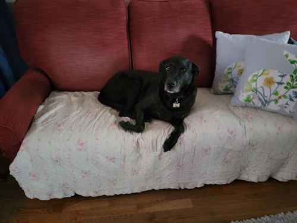
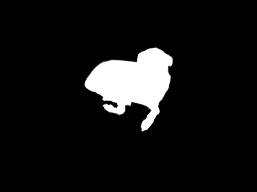
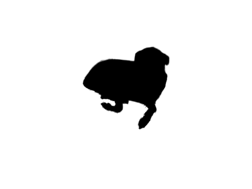

# Photoshop ActionJSON Recipes

This folder contains a set of recipes (examples) related to the [ActionJSON API](https://developer.adobe.com/firefly-services/docs/photoshop/api/photoshop_actionJSON/).

Note that the demo code assumes Amazon S3 credentials and a bucket you can use for testing.

## Invert Mask

This demo uses ActionJSON to invert the mask created from the [Create Mask](https://developer.adobe.com/firefly-services/docs/photoshop/api/photoshop_createMask/) API.

Given this input:



The mask is:



And the inverted mask is:



ActionJSON:

```json
[
	{
		"_obj": "invert"
	}
]
```

Demo Code: [./invertmask/demo.js](./invertmask/demo.js)